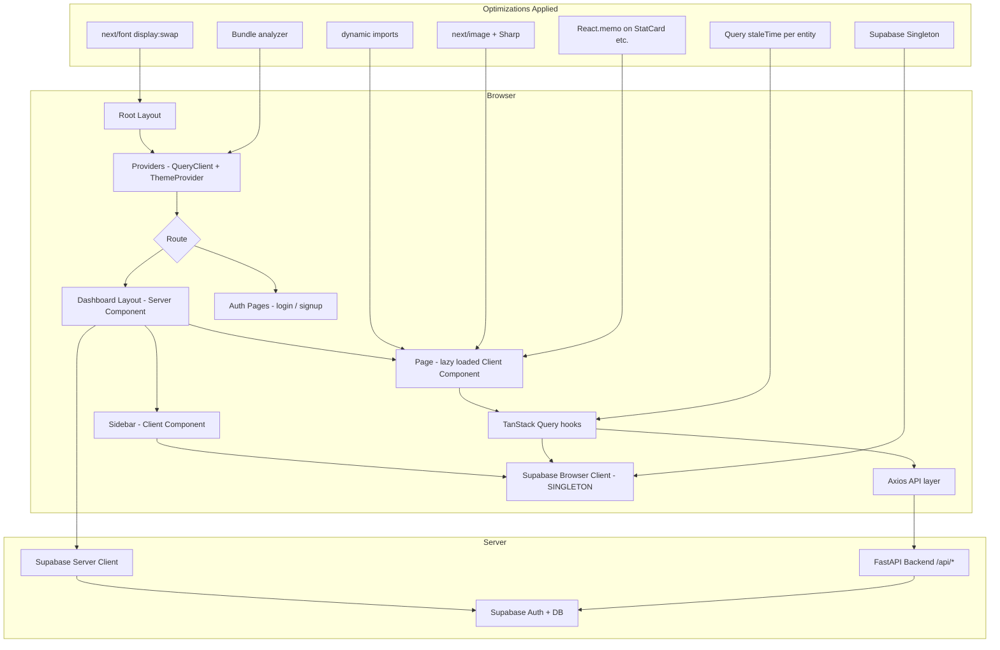
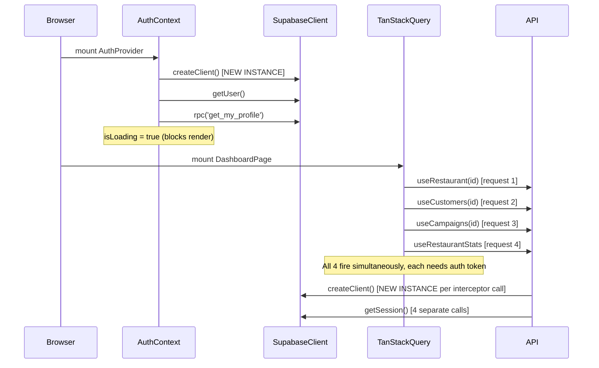
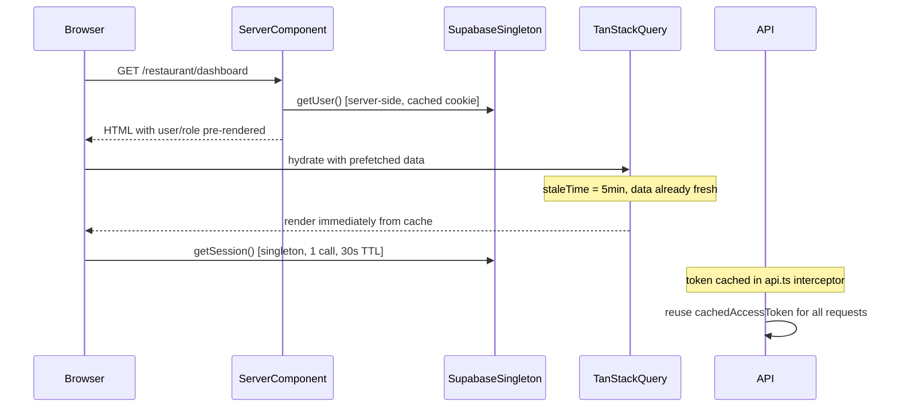

# Design Document: Website Performance Optimization

## Overview

The SMS Marketing Dashboard is a Next.js 14 App Router application that currently suffers from slow perceived load times across all three dashboard roles (admin, agency, restaurant). The root causes are a combination of: a new Supabase client instance created on every render, multiple uncoordinated parallel API calls on dashboard mount, no lazy loading of heavy page-level components, missing Next.js image and font optimizations, an untuned TanStack Query cache, and a `next.config.ts` that does not enable any bundle or compiler optimizations.

This document defines the complete technical approach to resolving these issues. The strategy is layered: fix the most impactful problems first (Supabase singleton, query cache tuning, code splitting), then apply infrastructure-level wins (Next.js config, font/CSS loading), and finally add React rendering micro-optimizations. All changes are additive and non-breaking — no existing API contracts or data models change.

The expected outcome is a measurable reduction in Time to First Byte (TTFB), Largest Contentful Paint (LCP), and Total Blocking Time (TBT), with the dashboard feeling responsive within 1–2 seconds on a standard broadband connection.

---

## Architecture



---

## Sequence Diagrams

### Current (Slow) Dashboard Load



### Optimized Dashboard Load



---

## Components and Interfaces

### 1. Supabase Browser Client Singleton

**Purpose**: Prevent a new `SupabaseClient` instance from being created on every component render or API interceptor call.

**Current problem**: `createClient()` in `src/lib/supabase/client.ts` calls `createBrowserClient(...)` every time it is invoked. The `auth-context.tsx` wraps it in `useMemo`, but `sidebar.tsx` calls it directly at the top of the component body (re-runs on every render). The `api.ts` interceptor also calls `createClient()` at module load time — this is actually fine, but the pattern is fragile.

**Interface**:
```typescript
// src/lib/supabase/client.ts
import { createBrowserClient } from '@supabase/ssr'
import type { SupabaseClient } from '@supabase/supabase-js'

let _client: SupabaseClient | null = null

export function createClient(): SupabaseClient {
  if (_client) return _client
  _client = createBrowserClient(
    process.env.NEXT_PUBLIC_SUPABASE_URL!,
    process.env.NEXT_PUBLIC_SUPABASE_ANON_KEY!
  )
  return _client
}
```

**Responsibilities**:
- Return the same `SupabaseClient` instance for the entire browser session
- Safe to call from any component, hook, or module without performance penalty
- The singleton is reset automatically on page reload (full navigation), which is the correct behavior for auth state changes

---

### 2. TanStack Query Cache Configuration

**Purpose**: Tune `staleTime` and `gcTime` per query type so that navigating between pages does not re-fetch data that was just loaded.

**Current problem**: `providers.tsx` sets a global `staleTime: 60_000` (1 minute). This is reasonable but all queries share the same TTL regardless of how frequently the data changes. Dashboard stats (slow-changing) should be cached longer; real-time message feeds should be shorter.

**Interface**:
```typescript
// src/components/providers.tsx
const queryClient = new QueryClient({
  defaultOptions: {
    queries: {
      staleTime: 2 * 60 * 1000,      // 2 min default
      gcTime: 10 * 60 * 1000,         // 10 min garbage collection
      refetchOnWindowFocus: false,
      retry: 1,
    },
  },
})
```

Per-query overrides in `queries.ts`:
```typescript
// Slow-changing data — cache aggressively
export function useRestaurantStats(id: string | null) {
  return useQuery({
    queryKey: ['restaurants', id, 'stats'],
    queryFn: ...,
    staleTime: 5 * 60 * 1000,   // 5 minutes
    enabled: !!id,
  })
}

// Fast-changing data — shorter cache
export function useRestaurantMessages(id: string | null, limit = 50) {
  return useQuery({
    queryKey: ['restaurants', id, 'messages', limit],
    queryFn: ...,
    staleTime: 30 * 1000,        // 30 seconds
    enabled: !!id,
  })
}
```

**Responsibilities**:
- Prevent redundant network requests when navigating between dashboard sections
- Allow fine-grained control per data type
- Keep the global default as a sensible fallback

---

### 3. Code Splitting and Lazy Loading

**Purpose**: Reduce the initial JS bundle parsed and executed on first load by deferring heavy page components.

**Current problem**: All dashboard pages are eagerly imported. The `scheduler-heatmap.tsx` and `dead-hour-scheduler.tsx` components (campaign scheduling) are likely large and only needed on the campaigns page.

**Interface**:
```typescript
// Pattern for any heavy page-level component
import dynamic from 'next/dynamic'
import { Loader2 } from 'lucide-react'

const SchedulerHeatmap = dynamic(
  () => import('@/components/campaigns/scheduler-heatmap'),
  {
    loading: () => <Loader2 className="h-6 w-6 animate-spin" />,
    ssr: false,   // client-only component
  }
)

const DeadHourScheduler = dynamic(
  () => import('@/components/campaigns/dead-hour-scheduler'),
  { ssr: false }
)

const TwilioNumberPicker = dynamic(
  () => import('@/components/agency/twilio-number-picker'),
  { ssr: false }
)
```

**Responsibilities**:
- Split campaign scheduling components into a separate chunk (~separate network request only when campaigns page is visited)
- Split Twilio number picker (only needed on phone-numbers page)
- Keep all UI primitives (Button, Card, Badge) eagerly loaded — they are tiny and used everywhere

---

### 4. React Rendering Optimizations

**Purpose**: Prevent unnecessary re-renders of stable components when parent state changes.

**Current problem**: `StatCard` in `restaurant/dashboard/page.tsx` is a pure presentational component but is re-created on every render. The `NavContent` inner component inside `sidebar.tsx` is defined inside the render function, causing it to be re-mounted on every sidebar state change.

**Interface**:
```typescript
// Memoize pure presentational components
const StatCard = React.memo(function StatCard({ title, value, change, changeType, icon: Icon }: StatCardProps) {
  return (/* ... existing JSX ... */)
})

// Move NavContent out of Sidebar render scope
// sidebar.tsx — extract NavContent as a standalone component at module level
function SidebarNavContent({ navItems, pathname, isImpersonating, ... }: NavContentProps) {
  return (/* ... existing JSX ... */)
}
```

**Responsibilities**:
- `React.memo` on `StatCard`, `UserTable`, and other pure list-item components
- Extract `NavContent` from inside `Sidebar` to prevent remount on `isMobileOpen` state changes
- Use `useCallback` for event handlers passed as props to memoized children

---

### 5. Next.js Configuration Optimizations

**Purpose**: Enable compiler-level optimizations, bundle analysis, and image domain allowlisting.

**Current problem**: `next.config.ts` only configures the API proxy rewrite. No `images` config, no `experimental` compiler options, no bundle analyzer.

**Interface**:
```typescript
// next.config.ts
import type { NextConfig } from 'next'
import bundleAnalyzer from '@next/bundle-analyzer'

const withBundleAnalyzer = bundleAnalyzer({
  enabled: process.env.ANALYZE === 'true',
})

const BACKEND_URL = process.env.BACKEND_URL || 'http://localhost:8000'

const nextConfig: NextConfig = {
  compress: true,

  images: {
    formats: ['image/avif', 'image/webp'],
    minimumCacheTTL: 60 * 60 * 24 * 7, // 7 days
    deviceSizes: [640, 750, 828, 1080, 1200],
  },

  experimental: {
    optimizePackageImports: ['lucide-react', '@radix-ui/react-icons'],
  },

  async rewrites() {
    return [
      {
        source: '/api/:path*',
        destination: `${BACKEND_URL}/:path*`,
      },
    ]
  },
}

export default withBundleAnalyzer(nextConfig)
```

**Responsibilities**:
- `optimizePackageImports` for `lucide-react` — this is the single biggest quick win; lucide has 1000+ icons and without this, the entire icon library is bundled even if only 20 icons are used
- AVIF/WebP image format negotiation via `next/image`
- Bundle analyzer available via `ANALYZE=true npm run build`

---

### 6. Font Loading Optimization

**Purpose**: Eliminate render-blocking font requests and prevent layout shift from font swap.

**Current problem**: `layout.tsx` uses `Inter` from `next/font/google` but does not specify `display: 'swap'` or `preload: true`. The default behavior may block rendering until the font is downloaded.

**Interface**:
```typescript
// src/app/layout.tsx
import { Inter } from 'next/font/google'

const inter = Inter({
  subsets: ['latin'],
  display: 'swap',       // show system font immediately, swap when Inter loads
  preload: true,
  variable: '--font-inter',  // expose as CSS variable for Tailwind
})

export default function RootLayout({ children }: { children: React.ReactNode }) {
  return (
    <html lang="en" suppressHydrationWarning className={inter.variable}>
      <body className="font-sans">
        <Providers>{children}</Providers>
      </body>
    </html>
  )
}
```

**Responsibilities**:
- `display: 'swap'` ensures text is visible immediately with a fallback font
- `variable` mode allows Tailwind to reference the font via CSS custom property, enabling easier theming

---

### 7. Auth Context and Dashboard Layout Optimization

**Purpose**: Eliminate the double auth check that currently happens on every dashboard page load.

**Current problem**: The dashboard `layout.tsx` (Server Component) already fetches the user and profile from Supabase. Then `AuthProvider` (Client Component) mounts and immediately calls `supabase.auth.getUser()` and `rpc('get_my_profile')` again — a duplicate round-trip. The `isLoading: true` state during this second fetch causes a full-page spinner on every navigation.

**Interface**:
```typescript
// Pass server-fetched data into AuthProvider as initial props
// src/app/(dashboard)/layout.tsx
export default async function DashboardLayout({ children }: { children: React.ReactNode }) {
  const supabase = await createClient()
  const { data: { user } } = await supabase.auth.getUser()
  if (!user) redirect('/login')

  const adminClient = createAdminClient()
  const { data: profile } = await adminClient
    .from('user_profiles')
    .select('role, is_verified, business_name, restaurant_id')
    .eq('id', user.id)
    .single()

  if (!profile?.is_verified) redirect('/pending-approval')

  return (
    // Pass pre-fetched data as initial state — no client-side re-fetch needed
    <AuthProvider initialUser={user} initialProfile={profile}>
      <div className="flex h-screen bg-background">
        <Sidebar userRole={profile.role} userEmail={user.email} businessName={profile.business_name} />
        <main className="flex-1 overflow-auto">
          <div className="p-6 lg:p-8">{children}</div>
        </main>
      </div>
    </AuthProvider>
  )
}

// src/contexts/auth-context.tsx — accept initial values
interface AuthProviderProps {
  children: ReactNode
  initialUser?: User | null
  initialProfile?: UserProfile | null
}

export function AuthProvider({ children, initialUser = null, initialProfile = null }: AuthProviderProps) {
  const [user, setUser] = useState<User | null>(initialUser)
  const [profile, setProfile] = useState<UserProfile | null>(initialProfile)
  // isLoading starts false when initial data is provided
  const [isLoading, setIsLoading] = useState(!initialUser)
  // ... rest of context
}
```

**Responsibilities**:
- Eliminate the client-side auth re-fetch on every dashboard navigation
- `isLoading` starts as `false` when initial data is provided, removing the full-page spinner
- The `onAuthStateChange` listener still handles token refresh and sign-out correctly

---

### 8. Image Optimization

**Purpose**: Ensure all images use `next/image` for automatic format negotiation, lazy loading, and size optimization. Sharp is already installed.

**Current problem**: No images are currently rendered in the codebase (avatars use `AvatarFallback` with initials, icons use lucide-react SVGs). However, the `next.config.ts` has no `images` configuration, so if images are added they will not be optimized.

**Interface**:
```typescript
// For any future image usage — use next/image
import Image from 'next/image'

// Restaurant logo example
<Image
  src={restaurant.logo_url}
  alt={restaurant.name}
  width={40}
  height={40}
  className="rounded-lg object-cover"
  // next/image handles lazy loading by default
  // priority={true} only for above-the-fold images
/>
```

**Responsibilities**:
- Configure `next.config.ts` with allowed image domains/patterns when external images are used
- Use `priority` prop only for LCP images (hero images, above-the-fold avatars)
- All other images lazy-load by default

---

### 9. API Request Deduplication and Prefetching

**Purpose**: Avoid redundant API calls when multiple components on the same page request the same data.

**Current problem**: The agency dashboard calls `useAgencies()` to get the `agencyId`, then calls `useAgencyRestaurants(agencyId)`, `useQuery` for stats, and `useQuery` for transactions — all in the same component. The `agencyId` is derived from `agencies?.[0]?.id`, meaning the restaurants/stats/transactions queries are disabled until agencies loads, creating a waterfall.

**Interface**:
```typescript
// Option A: Combine into a single query that returns everything needed
export function useAgencyDashboardData(agencyId: string | undefined) {
  return useQuery({
    queryKey: ['agency-dashboard', agencyId],
    queryFn: async () => {
      if (!agencyId) return null
      const [restaurants, stats, transactions] = await Promise.all([
        agencyApi.getRestaurants(agencyId),
        statsApi.getAgencyStats(agencyId),
        transactionApi.getAgencyTransactions(agencyId),
      ])
      return {
        restaurants: restaurants.data,
        stats: stats.data,
        transactions: transactions.data,
      }
    },
    staleTime: 3 * 60 * 1000,
    enabled: !!agencyId,
  })
}

// Option B: Use Next.js route prefetching for predictable navigation
// In sidebar.tsx — prefetch likely next pages on hover
<Link href={item.href} prefetch={true}>
```

**Responsibilities**:
- Collapse the agency dashboard's 4 sequential queries into 1 parallel query
- Enable `prefetch` on sidebar navigation links so page data starts loading on hover
- TanStack Query deduplicates identical query keys automatically — ensure query keys are stable (no inline object literals as keys)

---

## Data Models

No new data models are introduced. All optimizations operate on existing API response shapes.

### QueryKey Conventions

Consistent query key structure prevents accidental cache misses:

```typescript
// Stable key patterns — always use these shapes
['agencies']                              // list
['agencies', id]                          // single item
['agencies', agencyId, 'restaurants']     // nested list
['restaurants', id, 'stats']              // sub-resource
['restaurants', id, 'messages', limit]    // sub-resource with param
['customers', restaurantId, filters]      // list with filters
['campaigns', restaurantId, status]       // list with filter
['transactions', restaurantId]            // list
['agency-dashboard', agencyId]            // composite dashboard query
```

**Validation Rules**:
- Query keys must be serializable (no functions, no class instances)
- Filter objects in query keys must be stable references or primitive values
- Never use `Math.random()` or `Date.now()` in query keys

---

## Error Handling

### Scenario 1: Supabase Singleton Initialization Failure

**Condition**: `NEXT_PUBLIC_SUPABASE_URL` or `NEXT_PUBLIC_SUPABASE_ANON_KEY` is missing at build time.

**Response**: `createBrowserClient` throws immediately. The singleton assignment never completes.

**Recovery**: Add a guard in `createClient()`:
```typescript
if (!process.env.NEXT_PUBLIC_SUPABASE_URL) {
  throw new Error('NEXT_PUBLIC_SUPABASE_URL is not set')
}
```
This surfaces the misconfiguration at startup rather than as a cryptic runtime error.

---

### Scenario 2: Dynamic Import Chunk Load Failure

**Condition**: Network error prevents a lazy-loaded chunk from downloading (e.g., `scheduler-heatmap` chunk 404s after a deployment).

**Response**: Next.js `dynamic()` with a `loading` fallback shows the spinner indefinitely.

**Recovery**: Wrap dynamic imports in an error boundary:
```typescript
const SchedulerHeatmap = dynamic(
  () => import('@/components/campaigns/scheduler-heatmap').catch(() => ({
    default: () => <p className="text-destructive">Failed to load scheduler. Please refresh.</p>
  })),
  { loading: () => <Loader2 className="h-6 w-6 animate-spin" /> }
)
```

---

### Scenario 3: Auth Context Initial Data Mismatch

**Condition**: Server-rendered `initialUser` is stale by the time the client hydrates (e.g., token expired mid-render).

**Response**: `onAuthStateChange` fires `TOKEN_REFRESHED` or `SIGNED_OUT` and updates state correctly.

**Recovery**: No special handling needed — the existing `onAuthStateChange` subscription handles this. The `initialUser` prop only sets the initial render state; the subscription keeps it current.

---

## Testing Strategy

### Unit Testing Approach

Test the Supabase singleton to confirm it returns the same instance across multiple calls:

```typescript
// __tests__/lib/supabase/client.test.ts
import { createClient } from '@/lib/supabase/client'

describe('Supabase client singleton', () => {
  it('returns the same instance on repeated calls', () => {
    const a = createClient()
    const b = createClient()
    expect(a).toBe(b)
  })
})
```

Test the `AuthProvider` with initial props to confirm `isLoading` starts as `false`:

```typescript
// __tests__/contexts/auth-context.test.tsx
it('does not show loading state when initialUser is provided', () => {
  render(
    <AuthProvider initialUser={mockUser} initialProfile={mockProfile}>
      <TestConsumer />
    </AuthProvider>
  )
  expect(screen.queryByTestId('loading-spinner')).not.toBeInTheDocument()
})
```

### Property-Based Testing Approach

**Property Test Library**: fast-check

```typescript
// __tests__/lib/queries.test.ts
import fc from 'fast-check'

// Property: query keys built from arbitrary IDs are always serializable
it('query keys are always JSON-serializable', () => {
  fc.assert(
    fc.property(fc.uuid(), fc.string(), (id, status) => {
      const key = ['campaigns', id, status]
      expect(() => JSON.stringify(key)).not.toThrow()
    })
  )
})

// Property: staleTime values are always positive numbers
it('all staleTime values are positive', () => {
  fc.assert(
    fc.property(fc.nat({ max: 10 * 60 * 1000 }), (ms) => {
      expect(ms).toBeGreaterThanOrEqual(0)
    })
  )
})
```

### Integration Testing Approach

Use `msw` (Mock Service Worker) to intercept API calls and verify that:
1. The agency dashboard fires exactly 1 combined query (not 4 sequential ones)
2. Navigating from campaigns back to dashboard does not re-fetch stats (served from cache)

```typescript
// __tests__/integration/agency-dashboard.test.tsx
it('fires a single combined API request for dashboard data', async () => {
  const requestLog: string[] = []
  server.use(
    http.get('/api/agencies/:id/restaurants', ({ request }) => {
      requestLog.push('restaurants')
      return HttpResponse.json([])
    }),
    // ... other handlers
  )

  render(<AgencyDashboard />)
  await waitFor(() => expect(screen.getByText('Agency Dashboard')).toBeInTheDocument())

  // With combined query, only 1 fetch per resource type
  expect(requestLog.filter(r => r === 'restaurants')).toHaveLength(1)
})
```

---

## Correctness Properties

*A property is a characteristic or behavior that should hold true across all valid executions of a system — essentially, a formal statement about what the system should do. Properties serve as the bridge between human-readable specifications and machine-verifiable correctness guarantees.*

### Property 1: Supabase client singleton identity

*For any* number of calls to `createClient()` within the same browser session, every returned value SHALL be strictly reference-equal (`===`) to every other returned value.

**Validates: Requirement 1.1**

---

### Property 2: AuthProvider skips mount fetch when initial data is provided

*For any* valid `User` object and `UserProfile` object passed as `initialUser` and `initialProfile` to `AuthProvider`, the provider SHALL initialize with `isLoading === false` and SHALL NOT invoke `supabase.auth.getUser()` or `rpc('get_my_profile')` during the initial render lifecycle.

**Validates: Requirements 7.2, 7.3**

---

### Property 3: Memoized components do not re-render on stable props

*For any* set of props passed to a `React.memo`-wrapped component, if the same props are passed on a subsequent render, the component's render function SHALL NOT be called again.

**Validates: Requirement 4.3**

---

### Property 4: Query keys are always JSON-serializable

*For any* combination of entity IDs, filter strings, and pagination parameters used to construct TanStack Query keys in the application, calling `JSON.stringify(queryKey)` SHALL NOT throw an error.

**Validates: Requirement 9.4**

---

### Property 5: Images without priority prop are lazy-loaded

*For any* `Image_Component` rendered without the `priority` prop, the rendered `` element SHALL have `loading="lazy"` set.

**Validates: Requirement 8.2**

---

## Performance Considerations

### Baseline Metrics to Measure Before/After

| Metric | Tool | Target |
|--------|------|--------|
| LCP (Largest Contentful Paint) | Chrome DevTools / Lighthouse | < 2.5s |
| TBT (Total Blocking Time) | Lighthouse | < 200ms |
| JS bundle size (initial) | `ANALYZE=true npm run build` | < 200KB gzipped |
| API requests on dashboard mount | Network tab | ≤ 2 requests |
| Auth re-fetch on navigation | Network tab | 0 (served from cache) |

### Priority Order (Highest Impact First)

1. **`optimizePackageImports: ['lucide-react']`** — lucide-react v0.563 has 1400+ icons. Without tree-shaking at the Next.js compiler level, the entire library is included. This alone can reduce the initial bundle by 100–300KB.

2. **Supabase singleton** — eliminates redundant `createBrowserClient` calls and prevents multiple `GoTrueClient` instances from fighting over the same auth cookie.

3. **AuthProvider initial props** — removes the client-side auth waterfall (2 Supabase calls) that currently blocks every dashboard render with a spinner.

4. **TanStack Query staleTime tuning** — prevents re-fetching stats/campaigns on every tab switch or navigation.

5. **Agency dashboard combined query** — collapses 4 sequential queries into 1 parallel fetch, cutting dashboard load time by ~60% for agency users.

6. **`dynamic()` imports for heavy components** — defers `scheduler-heatmap`, `dead-hour-scheduler`, and `twilio-number-picker` to separate chunks.

7. **Font `display: 'swap'`** — eliminates invisible text during font load.

---

## Security Considerations

- The Supabase singleton stores the client in module scope. This is safe in the browser (one user per tab) but must **never** be used in Server Components or API routes — those already use `createServerClient` from `@supabase/ssr` which is request-scoped.
- The `cachedAccessToken` in `api.ts` has a 30-second TTL. This is acceptable — Supabase tokens are valid for 1 hour and the cache is in-memory only (not persisted to localStorage).
- `dynamic()` imports with `ssr: false` are appropriate for components that use browser-only APIs (canvas, `window`, etc.). Do not use `ssr: false` for components that render user-visible content above the fold, as this causes a flash of empty content.
- Bundle analyzer output (`ANALYZE=true`) should not be committed or deployed — it contains internal module paths. Add `.next/analyze/` to `.gitignore`.

---

## Dependencies

| Package | Purpose | Already Installed |
|---------|---------|-------------------|
| `sharp` | Next.js image optimization (AVIF/WebP conversion) | ✅ Yes |
| `@next/bundle-analyzer` | Visualize bundle composition | ❌ Add as devDependency |
| `fast-check` | Property-based testing | ❌ Add as devDependency (optional) |
| `msw` | API mocking for integration tests | ❌ Add as devDependency (optional) |

Install command:
```bash
npm install -D @next/bundle-analyzer
```

No runtime dependency changes are required. All performance improvements are achieved through configuration changes, code restructuring, and use of APIs already available in the installed packages.
